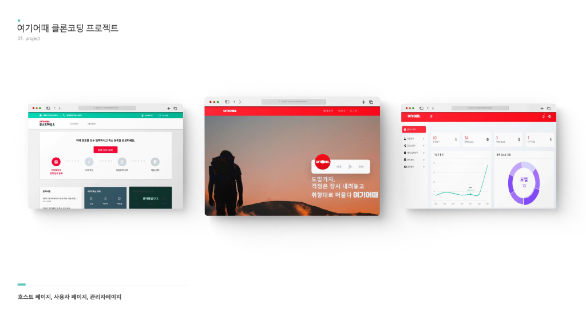
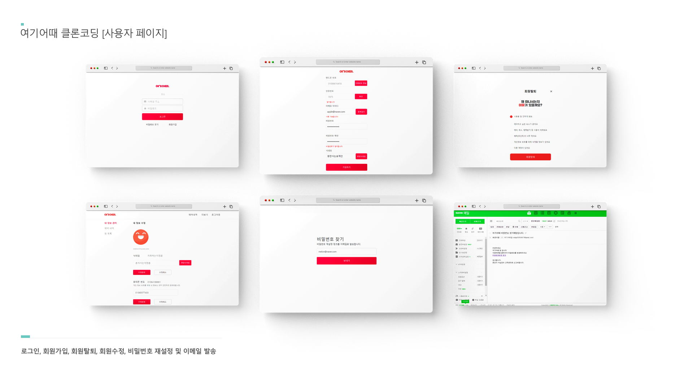
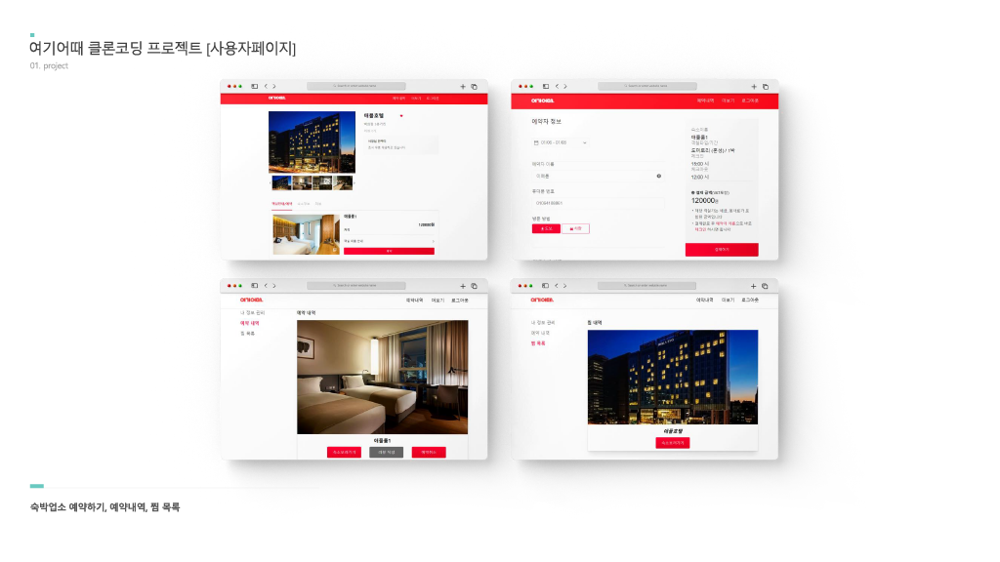
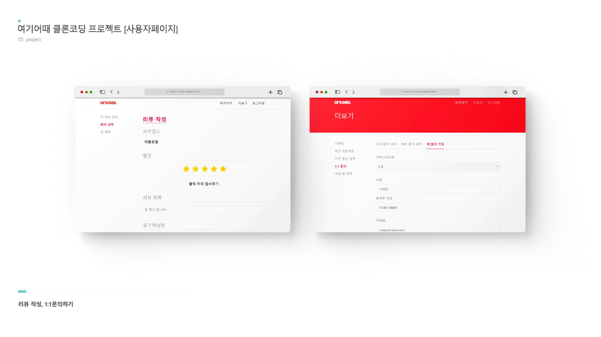
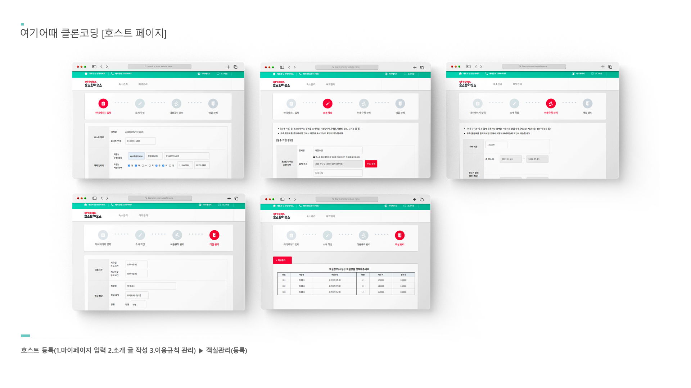
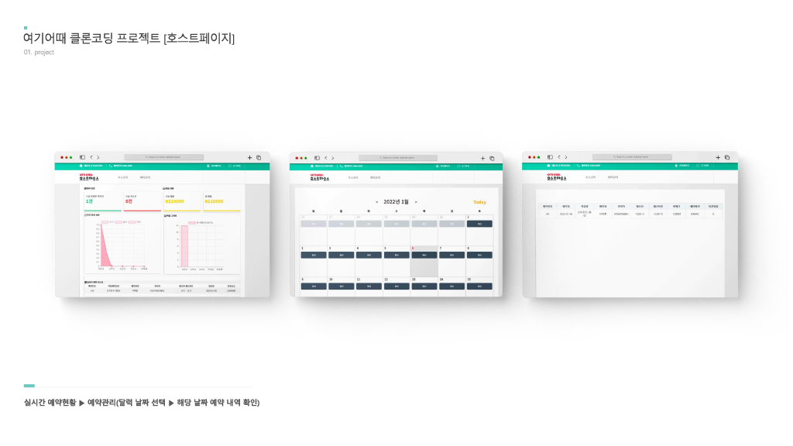
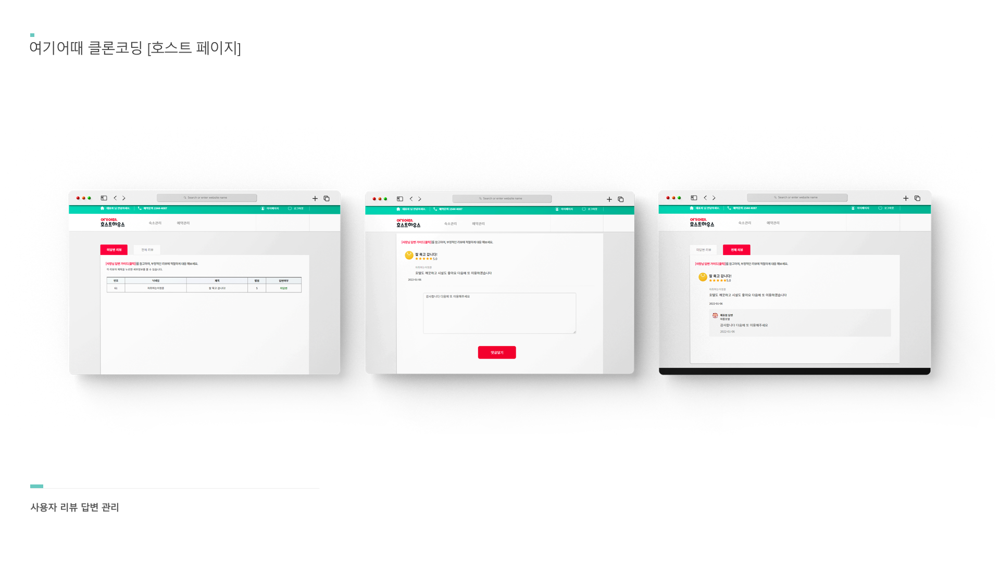
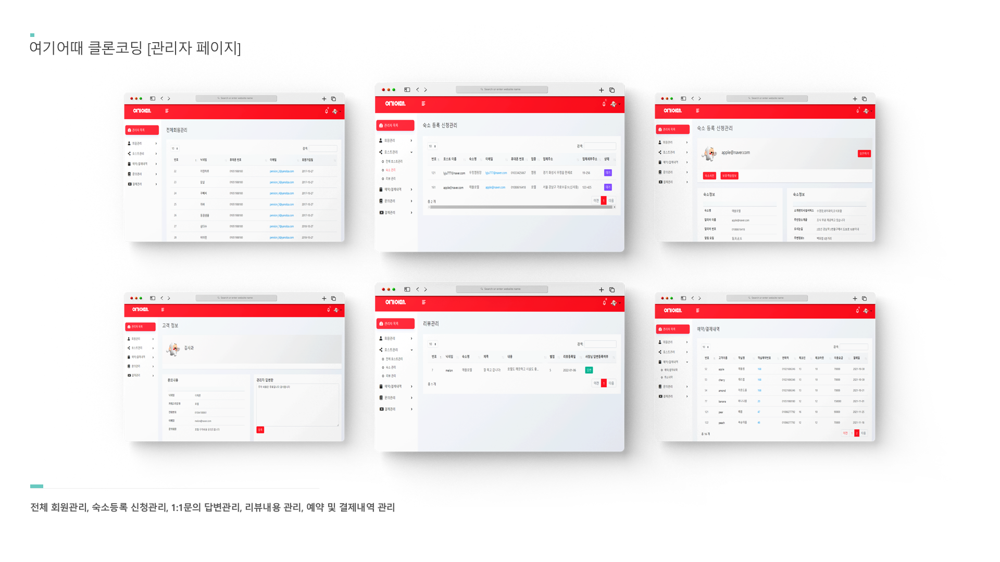

# final_yeogi-project

<br>

**💡프로젝트 설명**

여기어때 클론코딩 프로젝트는 기존의 여기어때 사이트를 클론하여 기획 의도에 맞게 재구성한 플랫폼입니다. Spring MVC 기반의 REST API 서버를 구축하고 Thymeleaf 템플릿을 통한 데이터 연동으로  사용자, 호스트, 관리자 기능을 구현하였습니다.

<br>

**🤝참여인원**

FrontEnd(4명) | BackEnd(2명)

<br>

**🛠️기술스택**

**Client :  `Javascript`  `jQuery`  `HTML`   `CSS`  `axios`  `Bootstrap`**   

**Server : `Java`  `JPA`  `Spring Boot`  `Oracle`  `Thymeleaf`**

<br>

**💻담당파트**

- 호스트 등록을 위한 페이지 Form UI 구현
- Custom DatePicker를 통한 날짜별 예약현황 조회 및 관리기능 구현
- chart.js 라이브러리를 활용한 호스트 예약 현황조회 및 대시보드 UI 구현
- 사용자 1:1문의 관리기능 구현
- 사용자(예약/결제내역) 조회기능 구현
- 검색 필터를 통한 전체 회원관리 조회기능 구현
- 관리자를 통한 호스트 등록 승인기능 구현

<br>

## 🪄 Install

### Requirements
```sh
plugins {
   id 'java'
   id 'org.springframework.boot' version '2.7.13'
   id 'io.spring.dependency-management' version '1.1.6'
}

group = 'com.rezero'
version = '0.0.1-SNAPSHOT'

java {
   toolchain {
      languageVersion = JavaLanguageVersion.of(11)
   }

```

<br>










