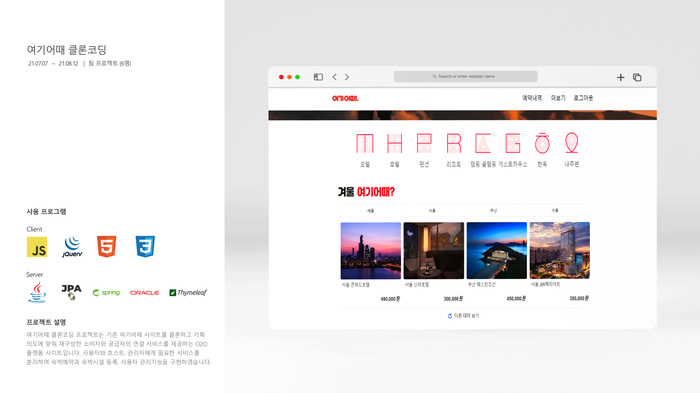

# final_yeogi-project

<br>

### 🛠 구현 기술
✅ Spring MVC기반 RESTful API 서버 구축

✅ Spring Security를 통한 사용자 인증 및 권한 부여 처리

✅ Axios와 Thymeleaf를 통한 데이터 통신 및 서버 사이드 랜더링 구현

✅ HTML, CSS, JavaScript 기반 사용자 인터페이스 생성

<br>

## 🪄 Install

### Requirements
```sh
plugins {
   id 'java'
   id 'org.springframework.boot' version '2.7.13'
   id 'io.spring.dependency-management' version '1.1.6'
}

group = 'com.rezero'
version = '0.0.1-SNAPSHOT'

java {
   toolchain {
      languageVersion = JavaLanguageVersion.of(11)
   }

```

<br>




